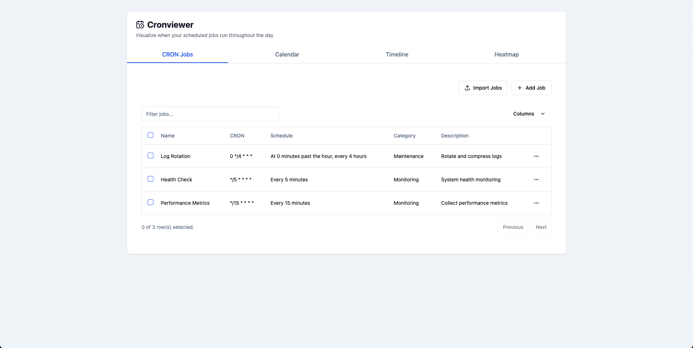
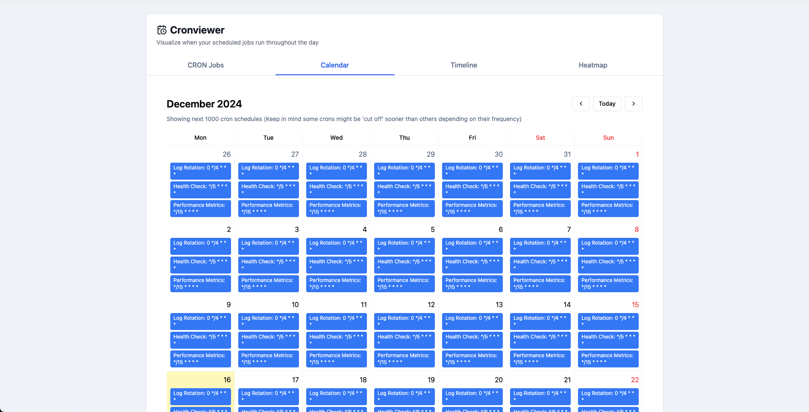
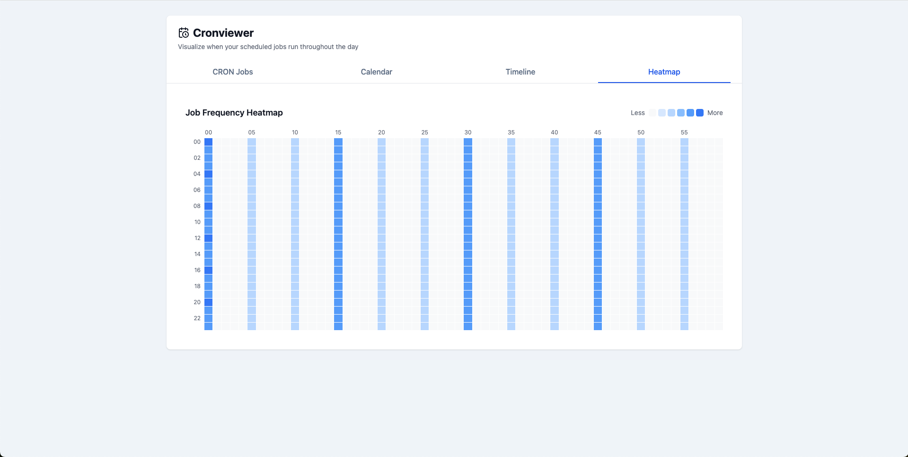

# Cronviewer

Visualize CRON jobs from your organization codebase on a timeline.

## Usage

Import your CRON jobs from a JSON/CSV/Crontab file or add them one by one.


Calendar view


Timeline view


Heatmap view


## Development

```bash
npm install
npm run dev
```
